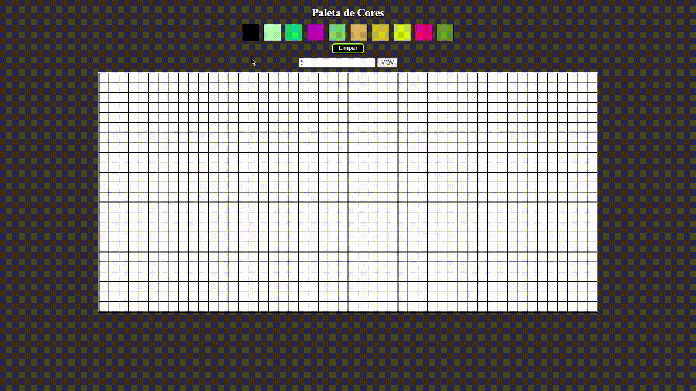

# Projeto Pixels Art - desenvolvido durante o curso da @trybe. 🙌
### Olá, eu sou Henrique Nascimento, Programador front-end 👋

Esse foi um projeto individual, usando basicamente HTML, CSS e JavaSript Vanilla.

### Ferramentas utilizadas:

 
  JavaScript
  
  HTML5
  
  CSS3
  

  
 ##
 
- Um dos primeiros projetos feitos na Trybe, durante o módulo de fundamentos. Para mim que estava tendo meus primeiros contatos com a programação, foi bem divertido trabalhar com eventos e com o DOM. Pude exercitar um pouco de CSS também e ter meu primeiro uso de template string. Analisar o código usando o clássico for me dá até uma nostalgia... Quero depois replicar esse projeto usando React.js.
 
## Rodando na sua máquina

- digite o comando a serguir no seu terminal:
-  ___git clone git@github.com:HenriqueNasciment0/PROJETO-PIXELS-ART-JS-VANILLA.git___
-  depois digite no terminal:
-  ___cd PROJETO-PIXELS-ART-JS-VANILLA___
-  se estiver usando o VS Code, use a extensão Live Server, clique no canto inferior da tela do VS Code em "Go Live" após instalar a extensão

 ## Link do deploy da aplicação 
 ___https://pixels-art-henriquen.netlify.app/___
   
  
 
  
  
     

